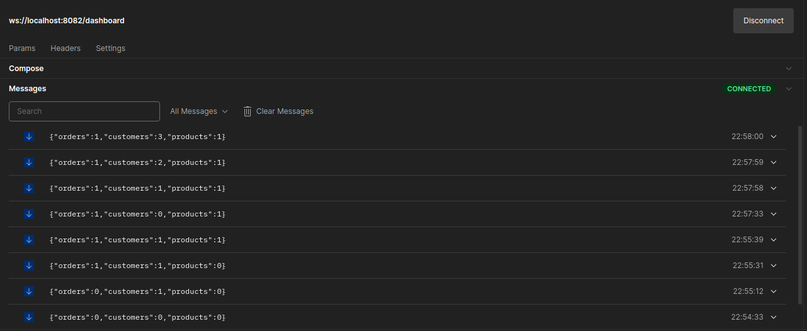

# Real time Dashboard using websockets

## Introduction
A dashboard is a data visualization and management tool that visually tracks and analyzes the Key Performance Indicators (KPIs), business analytics metrics, infrastructure health and status, and data points for an organization, team, or process. It can be used to present operational and analytical business data with interactive data visualizations to your team.

A real-time dashboard is a dashboard that contains charts that are automatically updated with the most current data available. The typical use case is to load a chart with some historical data first and then live update it as new data comes in.

WebSocket has become the de facto standard of building real-time dashboards and data visualizations. Unlike traditional dashboards based on periodic polling of databases, WebSockets allows its client to listen to the data coming from servers. That enables the backends to send new data to dashboards at the same time when something happens.

## Building Websocket Server for Dashboard
To get the proper understanding of the working of real-time dashboard lets create a simple websocket based server  which keeps track of some elements and updates all active websocket connection about the changes on tracked data. For sake of simplicity  we will only keep track of three variables ```products```, ```orders``` and ```customers```.
For this we will be using ```golang``` library ```github.com/gorilla/websocket``` for websocket connection and ```github.com/go-chi/chi``` for our server.

First, we create a ```DashboardData``` structure to store the tracked data.

    type DashboardData struct {
        Orders    int `json:"orders"`
        Customers int `json:"customers"`
        Products  int `json:"products"`
    }

For fetching Dashboard data we can use ```FetchDashboardHelper``` for fetch complete dashboard data:

    func (Dashboard *DashboardData) FetchDashboardHelper() []byte {
        data, err := json.Marshal(Dashboard)
        if err != nil {
            log.Printf("Error: %v", err)
        }
        return data
    }

We can add and remove dashboard data, we will be using ```AddDashboardData(s string)``` and ```RemoveDashboardData(s string) error``` functions:


    func (Dashboard *DashboardData) FetchDashboardHelper() []byte {
        data, err := json.Marshal(Dashboard)
        if err != nil {
            log.Printf("Error: %v", err)
        }
        return data
    }

    func (Dashboard *DashboardData) AddDashboardData(s string) {
        switch s {
        case ORDERS:
            Dashboard.Orders++
        case CUSTOMERS:
            Dashboard.Customers++
        case PRODUCTS:
            Dashboard.Products++
        }

        // update presently connected websocket connections about the dashboard changes
        go func() {
            update <- 1 
        }()
    }
    
    func (Dashboard *DashboardData) RemoveDashboardData(s string) error {
        switch s {
        case ORDERS:
            if Dashboard.Orders == 0 {
                return fmt.Errorf("no order remains to remove")
            }
            Dashboard.Orders--
        case CUSTOMERS:
            if Dashboard.Customers == 0 {
                return fmt.Errorf("no customer remains to remove")
            }
            Dashboard.Customers--
        case PRODUCTS:
            if Dashboard.Products == 0 {
                return fmt.Errorf("no product remains to remove")
            }
            Dashboard.Products--
        }

        // update presently connected websocket connections about the dashboard changes
        go func() {
            update <- 1
        }()
        return nil
    }

As you can see in from above code apart from updating dashboard data we are also sending a data on channel, it is so that we can change the updated channel to all the websocket connection currently connected to the server.
Below are the add and delete API handlers we are using to update dashboard:

    func AddOrder(w http.ResponseWriter, r *http.Request) {
        dashboard.AddDashboardData(ORDERS)
        _, err := w.Write([]byte("Order Added"))
        if err != nil {
            return
        }
        return
    }

    func AddCustomer(w http.ResponseWriter, r *http.Request) {
        dashboard.AddDashboardData(CUSTOMERS)
        _, err := w.Write([]byte("Order Added"))
        if err != nil {
            return
        }
        return
    }

    func AddProducts(w http.ResponseWriter, r *http.Request) {
        dashboard.AddDashboardData(PRODUCTS)
        _, err := w.Write([]byte("Order Added"))
        if err != nil {
            return
        }
        return
    }
    
    func RemoveOrder(w http.ResponseWriter, r *http.Request) {
        err := dashboard.RemoveDashboardData(ORDERS)
        if err != nil {
            w.WriteHeader(http.StatusBadRequest)
            return
        }
        _, err = w.Write([]byte("Order Added"))
        if err != nil {
            return
        }
        return
    }
    
    func RemoveCustomer(w http.ResponseWriter, r *http.Request) {
        err := dashboard.RemoveDashboardData(CUSTOMERS)
        if err != nil {
            w.WriteHeader(http.StatusBadRequest)
            return
        }
        _, err = w.Write([]byte("Order Added"))
        if err != nil {
            return
        }
        return
    }

    func RemoveProducts(w http.ResponseWriter, r *http.Request) {
        err := dashboard.RemoveDashboardData(PRODUCTS)
        if err != nil {
            w.WriteHeader(http.StatusBadRequest)
            return
        }
        _, err = w.Write([]byte("Order Added"))
        if err != nil {
            return
        }
        return
    }

Now, we have all the required handlers we will be needing for our Websocket server. Below is the ```main()``` function we used:
        
    var update chan int // channel to keep track when dashboard is updated
    var dashboard DashboardData // structure to store dashboard data
    
    func main() {
        fmt.Println("Starting Server...")
        update = make(chan int)
        router := chi.NewRouter()
        router.Route("/", func(ws chi.Router) {
            ws.Get("/dashboard", DashboardHandler)
            ws.Post("/sign-up", AddCustomer)
            ws.Post("/order", AddOrder)
            ws.Post("/product", AddProducts)
            ws.Delete("/order", RemoveOrder)
            ws.Delete("/product", RemoveProducts)
            ws.Delete("/sign-off", RemoveCustomer)
        })
        log.Fatal(http.ListenAndServe(":8082", router))
    }
As we run the above code out server will be hosted on ```localhost:8082```. 
Below is the Postman snippet of Dashboard API:



As we can see from above snippet user connected to server via websocket will get updated dashboard data with every change it will receive. Hence, user is get updated in real-time.

## Conclusion

WebSockets are one of the most interesting and convenient ways to achieve real-time capabilities in an application. It gives us a lot of flexibility to leverage full-duplex communications. In this blog, we have explored the applications of websockets and also created a real-time dashboard service using it which shows how data is handled in real-time.`**