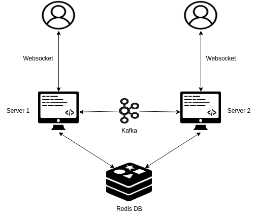
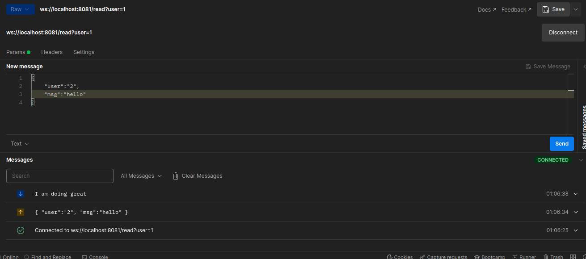
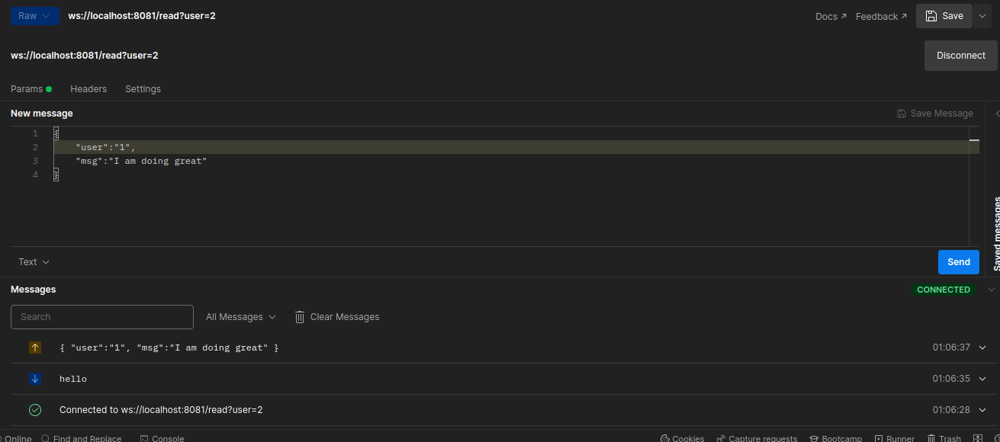

# Chatting app using Websockets

## Introduction

Real-time chat is virtually any online communication that provides a real-time or live transmission of text messages from sender to receiver. A variety of software programs are available to enable real-time chat between individuals using Internet services. Chat messages are often brief so as to let other participants respond swiftly, thereby creating a feeling much like a spoken conversation. This mode of communication differentiates real-time chats from other forms of text-based online communications, including emails and Internet forums. Real-time chat uses Web-based apps, which permit communication that is usually addressed directly but is anonymous among users in a multi-user environment.

WebSockets are a great fit for applications like chats or simple games. Chat sessions are usually long-lived, with the client receiving messages from other participants over a long period of time. Chat sessions are also bidirectional – clients want to send chat messages, and see chat messages from others.
Unlike regular HTTP requests, WebSocket connections can be kept open for a long time and have an easy interface for exchanging data between the client and server in the form of frames. WebSockets are also a widely supported technology. All modern browsers can work with WebSockets out of the box, and frameworks to work with WebSockets exist in many programming languages and on many platforms.

## Prerequisite
Before we move on to implementation there are basic terms and technologies we need to be familiar with.
### Kafka:
In order to handle large number of connections, we will be needing multiple instances of a server, thus there will be a need for a medium for server to server communication. In a very fast, reliable, persisted, fault-tolerance and zero downtime manner, Kafka offers a Pub-sub and queue-based messaging system. The producers send the message to a topic and the consumer can select any one of the message systems according to their wish.
### Redis:
For keeping account of online users and managing messages between multiple servers we would be needing a fast and reliable database system. Redis delivers sub-millisecond response times, enabling millions of requests per second for real-time applications in industries like gaming, ad-tech, financial services, healthcare, and IoT. Today, Redis is one of the most popular open source engines today, named the "Most Loved" database by Stack Overflow for five consecutive years. Because of its fast performance, Redis is a popular choice for caching, session management, gaming, leaderboards, real-time analytics, geospatial, ride-hailing, chat/messaging, media streaming, and pub/sub apps.

## Building a Chatting Application

Now, Since we have gotten familiar with the technologies we will be using, below is the design diagram for our application:



For our application, we will build a messaging server in ```Golang```

### Docker-compose setup
Below is the docker-compose file we will be using to set up our services:
    
    version: '2'
    services:
        zookeeper:
            image: confluentinc/cp-zookeeper:latest
        environment:
            ZOOKEEPER_CLIENT_PORT: 2181
            ZOOKEEPER_TICK_TIME: 2000
        ports:
            - 22181:2181
    
        kafka:
            image: confluentinc/cp-kafka:latest
            depends_on:
                - zookeeper
            ports:
                - 9093:9093
            environment:
                  KAFKA_BROKER_ID: 1
                  KAFKA_ZOOKEEPER_CONNECT: zookeeper:2181
                  KAFKA_ADVERTISED_LISTENERS: PLAINTEXT://kafka:9092,PLAINTEXT_HOST://localhost:9093
                  KAFKA_LISTENER_SECURITY_PROTOCOL_MAP: PLAINTEXT:PLAINTEXT,PLAINTEXT_HOST:PLAINTEXT
                  KAFKA_INTER_BROKER_LISTENER_NAME: PLAINTEXT
                  KAFKA_OFFSETS_TOPIC_REPLICATION_FACTOR: 1
                  KAFKA_CREATE_TOPICS: my-kafka-topic
        redis:
            image: 'bitnami/redis:latest'
            ports:
                - "6379:6379"
            environment:
                - ALLOW_EMPTY_PASSWORD=yes


In the above ```docker-compose.yml``` file images used:
- For Redis: ```bitnami/redis:latest```
- For Kafka: ```confluentinc/cp-kafka:latest```

Now that we have set up out docker-compose file we need to establish our services with our server using golang

For this we would be using golang library:
- For Redis: ```github.com/gomodule/redigo/redis```
- For Kafka: ```github.com/segmentio/kafka-go```
- For Websockets: ```github.com/gorilla/websocket```

To create a server lets create a server object to access the services

    type Server struct {
        userCons    map[string]*websocket.Conn
        ctx         context.Context
        reader      *kafka.Reader
        writer      *kafka.Writer
        mut         sync.Mutex
        RedisClient *redis.Client
    }

To initialize these services below is the ```InitService()``` function:

    func InitService() *Server {
        return &Server{
            userCons: make(map[string]*websocket.Conn),
            ctx:      context.Background(),
            reader: kafka.NewReader(kafka.ReaderConfig{
                Brokers: []string{"localhost:9093"},
                Topic:   "my-kafka-topic",
                GroupID: "group1",
            }),
            writer: &kafka.Writer{
                Addr:     kafka.TCP("localhost:9093"),
                Topic:    "my-kafka-topic",
                Balancer: &kafka.Murmur2Balancer{},
            },
            mut: sync.Mutex{},
            RedisClient: redis.NewClient(&redis.Options{
                Addr:     "localhost:6379",
                Password: "",
                DB:       0,
            }),
        }
    }

Now that we have initialized our services, we need to create a structure to encode-decode messages.
Below is the structure we will be using:

    type UserMessage struct {
        User    string `json:"user"`
        Message string `json:"msg"`
    }

The user in the structure will have recipient user ID and Message we need to send.

Now, we can start creating our handler to receive and send messages.
Let's start with initialing a handshake using ```Upgrade()``` method

        // Upgrade your connection to websocket connection
        conn, err := upgrades.Upgrade(w, r, nil)
        if err != nil {
            w.WriteHeader(http.StatusInternalServerError)
            return
        }

Once handshake is done we need to check for sender user ID from parameters and mark him online. To do that we will be using Redis and userCons map to store connection object and tag user online

	    // Get Sender user ID from parameter
	    inID := r.URL.Query().Get("user")

        // Writing connection in user connection map and into the redis to keep account if user is online into which server
	    srv.mut.Lock()
	    srv.userCons[inID] = conn
	    srv.RedisClient.Set(inID, "true", 0)
    	srv.mut.Unlock()

Once we mark user online we will be sending user un-recieved messages which he may got when he was offline. We are storing un-recieved messages into our Redis Database.

	    // Sending un-recieved messages which was sent when user was offline
	    
        // Retrieving messages from Redis server
	    val, err := srv.RedisClient.Get(inID + "msg").Result()
        if err == nil && val != "" {
            // Function to send old messaged to the user
            go srv.SendOldMsg(inID, val)
        }

    func (srv *Server) SendOldMsg(key string, uMsgs string) {
        fmt.Println("Sending old messages")
        // splitting old messages
        messages := strings.Split(uMsgs, "|")
        srv.mut.Lock()
        for _, msg := range messages {
            // sending un-received message to the user via websocket
            if err := srv.userCons[key].WriteMessage(1, []byte(msg)); err != nil {
                return
            }
        }
        srv.RedisClient.Set(key, "", 0)
        srv.mut.Unlock()
    }

Now once user received his messages we can start with chatting session we will be using 2 ```go func()``` for that one will receive messages from websocket and broadcast it into ```kafka``` and the other will receive messages from Kafka and send it to recipient via websocket. In case the recipient is offline, the messages send by the user will be stored into redis.

        // Receiver Server
        go func() {
            for {
                // Get messages from kafka which was broadcast by the server to which sender was connected to
                msg, err := srv.reader.ReadMessage(srv.ctx)
                if err != nil {
                    break
                }
                fmt.Println("Kafka Message received: ", string(msg.Value))
                
                var usrMsg UserMessage
                
                err = json.Unmarshal(msg.Value, &usrMsg)
                if err != nil {
                    break
                }
                fmt.Println("Received:", usrMsg)
                
                // Retrieve connection object from map and send received messages to user via websocket
                srv.mut.Lock()
                // Checking if recipient is connected to the server
                if conn, ok := srv.userCons[usrMsg.User]; ok {
                    // if recipient is connected sending messages via websocket
                    if err := conn.WriteMessage(1, []byte(usrMsg.Message)); err != nil {
                        break
                    }
                }
                srv.mut.Unlock()
            }
        }()
Above code receives message from ```kafka``` and checks if recipient is connected to the server. If there exist a connection, server sends the message to recipient via websocket.
    
        // Sender Server
        for {
            // Getting messages from websoket 
            _, body, err := conn.ReadMessage()
            if err != nil {
                break
            }
            // structure containing recipient user ID and messages
            var usrMsg UserMessage
            err = json.Unmarshal(body, &usrMsg)
            if err != nil {
                break
            }
            // checking if recipient is connected to any of the server instances via Redis
            val, err = srv.RedisClient.Get(usrMsg.User).Result()
            if err != nil || val == "false" {
                // if recipient is not connected, saving messages to redis, so that recipient can receive them when he comes online
                val, err := srv.RedisClient.Get(usrMsg.User + "msg").Result()
                if err != nil {
                    val = usrMsg.Message
                } else {
                    // if there are already old messages, appending new messages to them
                    val = val + "|" + usrMsg.Message
                }
                // writing un-recieved messages to redis for recipient to read when he comes online
                srv.mut.Lock()
                srv.RedisClient.Set(usrMsg.User+"msg", val, 0)
                srv.mut.Unlock()
                
                log.Printf("Succes: Msg written in redis for user: %v and msg: %v", usrMsg.User, usrMsg.Message)
            } else {
                // In case recipient is online broadcasting message via kafka so that receiver server can get the message
                tmp := string(body)
                msg := kafka.Message{
                    Key:   []byte(usrMsg.User),
                    Value: []byte(tmp),
                }
                // writing message to kafka
                err = srv.writer.WriteMessages(srv.ctx, msg)
                if err != nil {
                    log.Printf("Error: %v", err)
                }
                log.Printf("Succes: Msg written in kafka for user: %v and msg: %v", usrMsg.User, string(msg.Value))
            }
        }
Above code receives ```json encoded``` messages from websocket and decode it into the structure. If the recipient is online, the server will broadcast the message into kafka so that the server instance to which recipient is connected will receive the message. In case recipient is offline, the messages will be stores in redis.    
 
        // return to handler in case user disconnect from server
        // setting map and redis, so that user appears offline
        srv.mut.Lock()
        delete(srv.userCons, inID)
        srv.RedisClient.Set(inID, "false", 0)
        srv.mut.Unlock()
        fmt.Println("User Deleted Redis")
    
Once the connection is disconnected, we will remove the connection object from the map and mark user as offline in redis. 


It is worth to note that in the above code there are 2 channels for redis one store the user un-recieved messages and other to store user online status.

The code demonstrates how a multi-instance server chatting service will work and how messages will manage such a complex system.

Below is the ```main()``` func we used for the server:

    func main() {
        srv := InitService()
        fmt.Println("Starting Server...")
        router := chi.NewRouter()
        router.Route("/", func(ws chi.Router) {
            ws.Get("/", srv.Alive)
            ws.Get("/read", srv.ReadMsg)
        })
        log.Fatal(http.ListenAndServe(":8081", router))
    }

We can test this server by sending websocket request via postman. 
Below is the output snippets of postman:





## Conclusion:

In this blog, we explored real-time chatting service, their system-design and how the messages are handle. Also we have implemented a multi-server instance chatting service which is managed but services like redis and kafka due to which are able to transmit messages reliably between user with very low latency. 